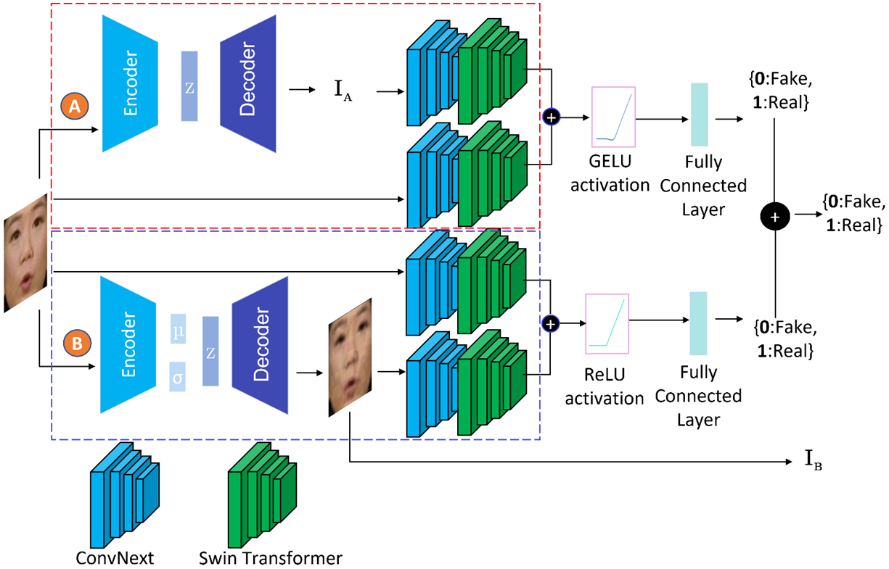

# Deepfake Video Detection Using Slightly Modified and Enhanced Generative Convolutional Vision Transformer

This repository contains the implementation code adapted from [GenConViT](https://github.com/erprogs/GenConViT) for **Deepfake Video Detection Using Slightly Modified and Enhanced Generative Convolutional Vision Transformer (GenConViT)** paper. Find the full paper on arXiv [here](https://arxiv.org/abs/2307.07036).

This repo contribution is to improve the ed model architecture. Improvements are compared to only the original GenConViT's ed model but not the other components. We applied the same training process to our modified model, which has around 57 million parameters. It achieved
a precision of 0.8501, a recall of 0.951, an F1 score of 0.8977, and an accuracy of 0.8809. The F1 score of our model is 0.1115% greater than that of the original GenConViT's ed model, while our parameters are decreased by
3.11%.
<br/><br/>

<p align="center">The Original GenConViT Deepfake Detection Framework</p>

<p style="text-align: justify;">
Deepfakes have raised significant concerns due to their potential to spread false information and compromise digital media integrity. In this work, we propose a Generative Convolutional Vision Transformer (GenConViT) for deepfake video detection. Our model combines ConvNeXt and Swin Transformer models for feature extraction, and it utilizes Autoencoder and Variational Autoencoder to learn from the latent data distribution. By learning from the visual artifacts and latent data distribution, GenConViT achieves improved performance in detecting a wide range of deepfake videos. The model is trained and evaluated on DFDC, FF++, DeepfakeTIMIT, and Celeb-DF v2 datasets, achieving high classification accuracy, F1 scores, and AUC values. The proposed GenConViT model demonstrates robust performance in deepfake video detection, with an average accuracy of 95.8% and an AUC value of 99.3% across the tested datasets. Our proposed model addresses the challenge of generalizability in deepfake detection by leveraging visual and latent features and providing an effective solution for identifying a wide range of fake videos while preserving media integrity.
</p>

## Enhanced Model Architecture
Note that we don't use the original VAE module.
The enhanced model consists of two independent networks and incorporates the following modules:
<pre>
    Autoencoder (ed),
    ConvNeXt-Swin Hybrid layer
</pre>
You can find the enhanced model architecture in `model/genconvit_ed_new.py`.

The code in this repository enables training and testing of the GenConViT model for deepfake detection.

## Table of Contents

- [Requirements](#requirements)
- [Usage](#usage)
  - [Model Training](#model-training)
  - [Model Testing](#model-testing)
- [Results](#results)

## Requirements
<pre>
    * Python 3.x
    * PyTorch
    * numpy
    * torch
    * torchvision
    * tqdm
    * decord
    * dlib
    * opencv
    * face_recognition
    * timm
</pre>

## Usage

1. Clone this repository:

```bash
git clone https://github.com/warrenwong641/GenConViT_modifed.git
```

2. Install the required dependencies:

```bash
pip install -r requirements.txt
```

## Model Training

To train the GenConViT model, follow these steps:

1. Prepare the training data, or use the sample training data provided:
    * Ensure that the training data is located in the specified directory path.
    * The training data should be organized in the required format. The `fake` directory contains images that are fake, while the `real` directory contains images that are real.
<pre>
    train:
        - fake
        - real
    valid:
        - fake
        - real
    test:
        - fake
        - real
</pre>
 

2. Run the training script:

```bash
python train_model.py
    -d <training-data-path>
    -m 'ed'
    -e <num-epochs>
    -p <pretrained-model-file>
    -b <batch-size>
    -t
```

`<training-data-path>`: Path to the training data.<br/>
`<model-variant>`: since we don't use the original VAE module, we use `ed` instead.<br/>
`<num-epochs>`: Number of epochs for training.<br/>
`<pretrained-model-file>` (optional): Specify the filename of a pretrained model to continue training.<br/>
`-b` (optional): Batch size for training. Default is 32.<br/>
`-t` (optional): Run the test on the test dataset after training.

The model weights and metrics are saved in the `weight` folder.

**Example usage:** 
```bash
python train_model.py --d sample_train_data --m ed --e 5 -t y
```

## Model Testing
**Deepfake Detection using GenConViT**

If you have trained a new model (e.g., if we have `weight/genconvit_vae_May_16_2024_09_34_21.pth`) and want to test it, use the following:

ED:
```
python image_test.py --weight_path weight/genconvit_ed_Nov_28_2024_01_05_29.pth --model_type ed --batch_size 1
```
